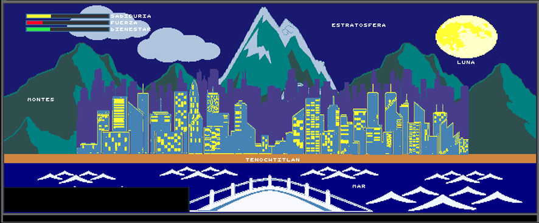
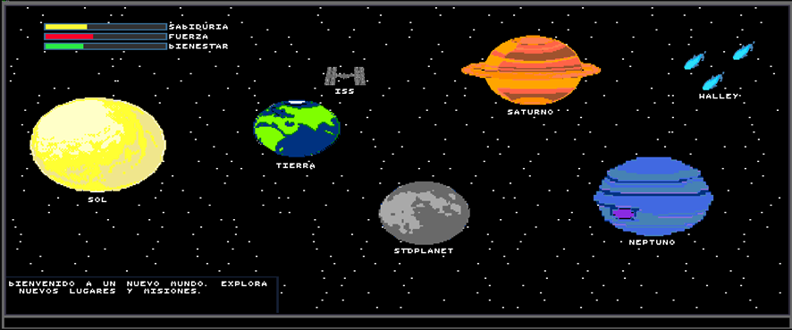
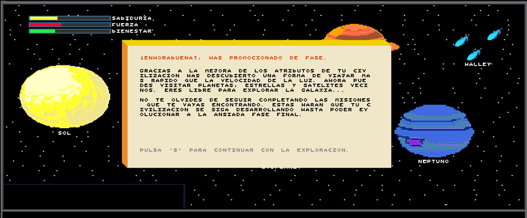
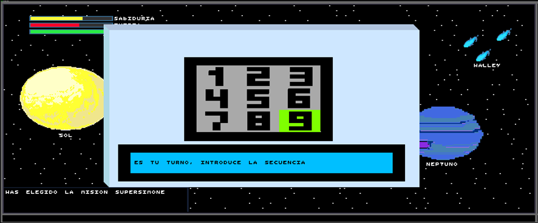
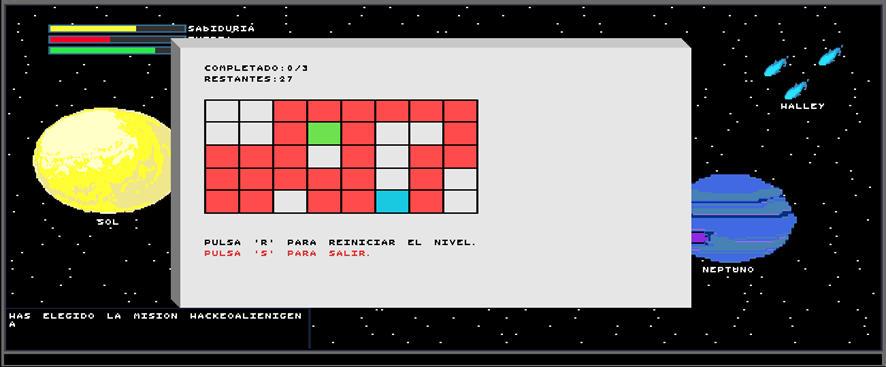
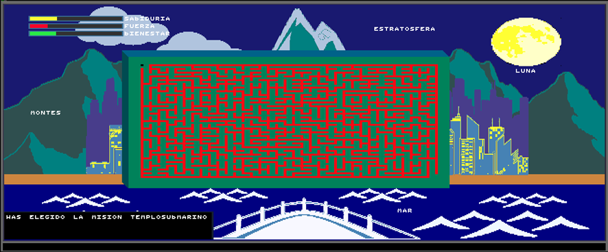

# 🚀 Ad Astra

¡Bienvenido a **Ad Astra Chronicles**! 🌟

## Introducción

Sumérgete en una aventura épica en la que tu civilización nace en la Tierra y se expande hacia el espacio. Según cuenta una vieja leyenda intergaláctica, existe una galaxia muy especial en un rincón perdido del universo... **La llaman Ad Astra**.

En este juego, tu misión es desarrollar y evolucionar tu civilización potenciando tres atributos fundamentales: **sabiduría**, **fuerza** y **bienestar**. ¡Demuestra que tu pueblo puede superar cualquier reto y convertirse en la cultura más poderosa del universo!

---

## Mundos del Juego

El juego se desarrolla en dos escenarios únicos:

### 1. Planeta Tierra 🌍
*Es el hogar de tus orígenes, donde comienza la aventura y se forjan las primeras bases de tu civilización.*

  

### 2. El Espacio 🌌
*Explora el vasto universo en busca de Ad Astra, la galaxia legendaria llena de recursos y sabiduría. Tu civilización tendrá la oportunidad de conquistar nuevos horizontes en este intrigante entorno.*

  

---

## Historia y Objetivos

Según dicen, Ad Astra es la galaxia con más recursos de todas, tan próspera e idílica que cualquier civilización que la habite se transformaría en la más sabia y poderosa del universo.  
*¡Nunca ha habido una cultura que lograra desarrollarse lo suficiente como para encontrar Ad Astra... hasta ahora!*

Para lograrlo:
- **Completa misiones:** Enfréntate a puzles, acertijos y desafíos de administración de recursos. 🧩
- **Gana puntos de bonificación:** Cada misión superada aumenta tus atributos y acelera la evolución de tu civilización. 💪📈
- **Evoluciona:** Una vez que acumules suficientes puntos, ¡podrás evolucionar y dar el salto a una nueva etapa! 🔄

Recuerda, la colonización de Ad Astra será más exitosa cuanto menos tiempo tardes en alcanzarla. ⏱️

---

## Comandos del Juego

El juego se basa en **minijuegos** y se controla a través de comandos escritos.
  
  

A continuación, se detallan las órdenes que podrás ejecutar:

- **`*/goto nombre_lugar`**  
  *Usa este comando para desplazarte por el mapa y visitar distintos lugares.* 🗺️

- **`*/mis nombre_mision`**  
  *Accede a un minijuego relacionado con el lugar en el que te encuentras.* 🎮

- **`*/evolve`**  
  *Prueba a evolucionar tu civilización. Úsalo cuando sientas que tienes suficientes puntos en tus atributos para promocionar a la siguiente fase. ❗Debes ejecutar este comando para pasar de mundo y para ganar el juego.* 🚀

  

- **`*/help`**  
  *Muestra este menú de ayuda para recordar todos los comandos disponibles.* ℹ️

---

## Minijuegos

La experiencia de **Ad Astra Chronicles** se centra en minijuegos. A medida que explores el mapa, te enfrentarás a:
- **Puzles y acertijos** 🧠
- **Retos de explotación de recursos** ⚙️
- **Desafíos ciudadanos** 👥

Cada minijuego te otorgará puntos de bonificación en los atributos de tu civilización.  
*Si fallas en alguno, ¡no te preocupes! Puedes reintentarlo tantas veces como necesites.* 🔄

  
  
  

---

## Instalación

La instalación es muy sencilla y consta de los siguientes 3 pasos:

1. **Inicia el juego** Descarga el repositorio  🎮
2. **Utiliza los comandos** Asegúrate de tener una versión de GCC instalada (>= 9.2, aunque anteriores pueden también valer).  💡
3. **Completa misiones** Reduce el tamaño de letra de terminal al mínimo posible.  🔴
4. **Completa misiones** En el directorio raíz ejecuta `make game`. ¡Y LISTO, YA PUEDES EMPEZAR A JUGAR!  🚀

---

## 👥 Autores

Este juego fue creado con pasión y dedicación por el equipo de **NOVA Inc.**  

- [@mrrodero](https://github.com/mrrodero)
- [@jgimillo](https://github.com/jgimillo)
- [@AlberCC](https://github.com/AlberCC)
- [@EduardoTerres](https://github.com/EduardoTerres)

Agradecemos cualquier mejora o arreglo. 🙏

---

## Créditos

Desde **NOVA Inc.** esperamos que disfrutes de esta aventura.  
¡Buena suerte y que comience la conquista de Ad Astra! 🌟

---
