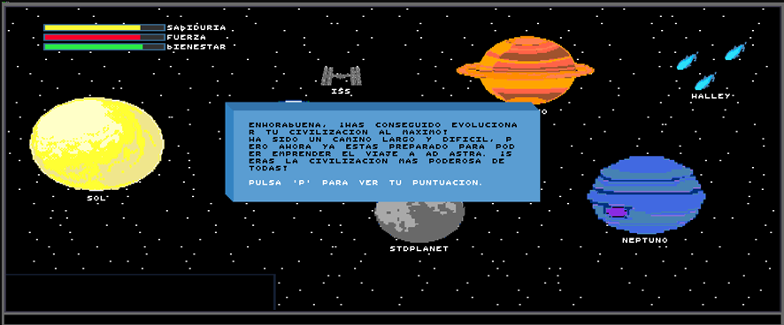

# 🚀 Ad Astra

[📄 🇪🇸 Spanish](README.md)

Welcome to **Ad Astra**! 🌟

## Introduction

Immerse yourself in an epic adventure where your civilization is born on Earth and expands into space. According to an ancient intergalactic legend, there is a very special galaxy hidden in a remote corner of the universe... **They call it Ad Astra**.

In this game, your mission is to develop and evolve your civilization by enhancing three fundamental attributes: **wisdom**, **strength**, and **well-being**. Prove that your people can overcome any challenge and become the most powerful culture in the universe!

---

## Game Worlds

The game takes place in two unique environments:

### 1. Planet Earth 🌍
*This is where your origins lie, where the adventure begins, and the foundations of your civilization are forged.*

  

### 2. Outer Space 🌌
*Explore the vast universe in search of Ad Astra, the legendary galaxy filled with resources and wisdom. Your civilization will have the opportunity to conquer new horizons in this intriguing environment.*

  

---

## Story & Objectives

According to legend, Ad Astra is the richest galaxy of all, so prosperous and idyllic that any civilization that inhabits it would become the wisest and most powerful in the universe.  
*No culture has ever developed enough to find Ad Astra... until now!*

To achieve this:
- **Complete missions:** Face puzzles, riddles, and resource management challenges. 🧩
- **Earn bonus points:** Each completed mission increases your attributes and speeds up your civilization’s evolution. 💪📈
- **Evolve:** Once you accumulate enough points, you can evolve and progress to the next stage! 🔄

Remember, colonization of Ad Astra will be more successful the faster you reach it. ⏱️

---

## Game Commands

The game is based on **mini-games** and is controlled through written commands.

  

  

Here are the commands you can use:

- **`*/goto location_name`**  
  *Use this command to move around the map and visit different locations.* 🗺️

- **`*/mis mission_name`**  
  *Access a mini-game related to the place where you are.* 🎮

- **`*/evolve`**  
  *Try to evolve your civilization. Use it when you feel you have accumulated enough points in your attributes to advance to the next phase.*
❗ You must execute this command to progress to the next world... 🚀

*❗And finally, to win the game...* ⭐

- **`*/help`**  
  *Displays this help menu to remind you of all available commands.* ℹ️

---

## Mini-Games

The **Ad Astra Chronicles** experience revolves around mini-games. As you explore the map, you will face:
- **Puzzles and riddles** 🧠
- **Resource exploitation challenges** ⚙️
- **Citizen management challenges** 👥

Each mini-game will grant you bonus points for your civilization's attributes.  
*If you fail a challenge, don’t worry! You can retry as many times as you need.* 🔄

  
  
  

---

## Installation

Installation is very simple and consists of the following 3 steps:

1. 📥 **Download this repository** 🎮  
2. 🛠️ **Make sure you have GCC installed** (>= 9.2, although older versions may also work). 💡  
3. 🔍 **Reduce the terminal font size to the minimum** 📉  
4. 💾 **In the root directory, run** `make game`. And that's it, YOU'RE READY TO PLAY! 🚀🎉  

---

## 👥 Authors

This game was created with passion and dedication by the **NOVA Inc.** team.  

- [@mrrodero](https://github.com/mrrodero)
- [@jgimillo](https://github.com/jgimillo)
- [@AlberCC](https://github.com/AlberCC)
- [@EduardoTerres](https://github.com/EduardoTerres)

We appreciate any improvements or fixes. 🙏

---
